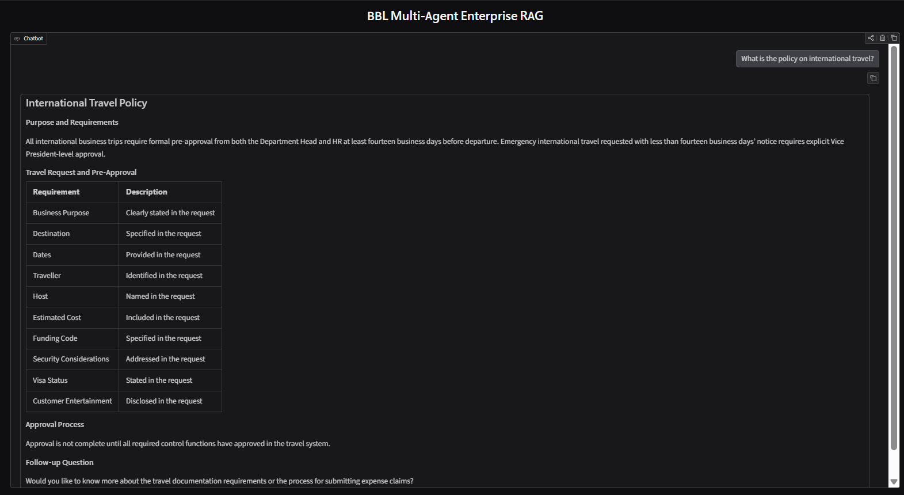
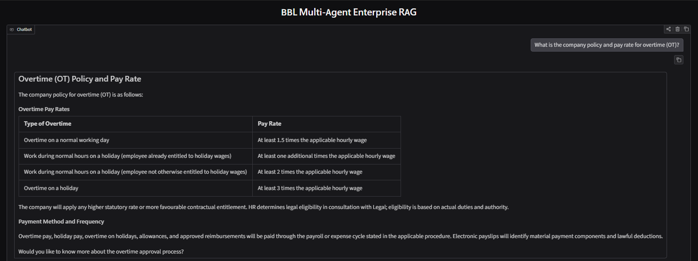
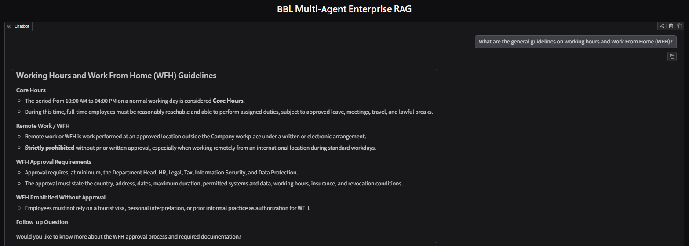
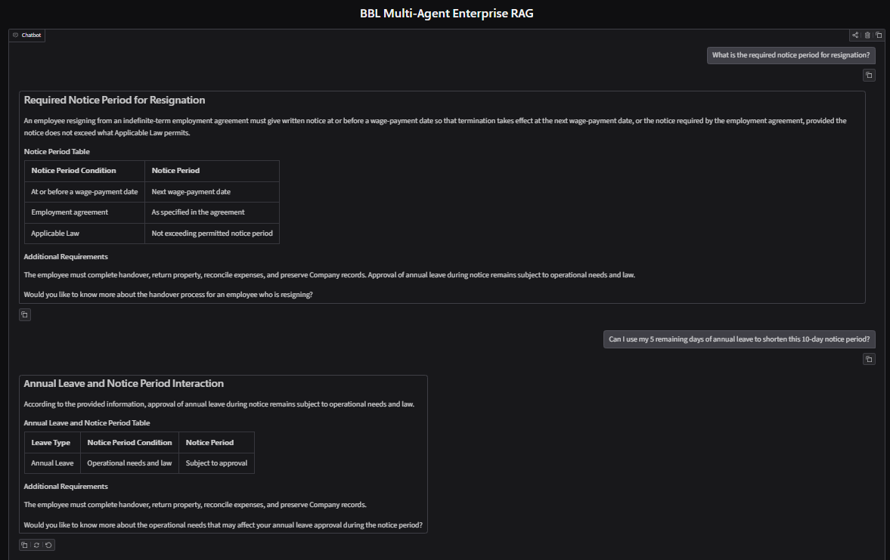
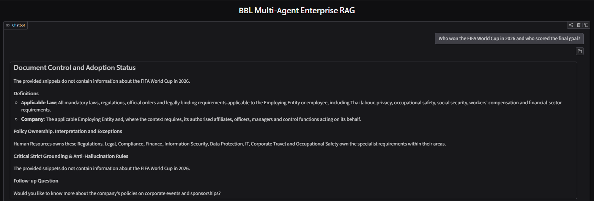

# Agentic AI RAG System — Bangkok Bank AI Engineer Test

An Agentic AI system utilizing multi-agent orchestration combined with Retrieval-Augmented Generation (RAG). Developed by **Parvadol Kiratipongvut** as part of the AI Engineer Programming Test for Bangkok Bank.

---

## Project Overview

This project demonstrates a sequential multi-agent workflow designed to retrieve accurate context from a local knowledge base and synthesize it into well-formatted answers with low-latency execution and high language consistency.

### Agent Workflow
1. **Guardrail Check (Security Layer):**
   - **Role:** Screens user input using `meta-llama/llama-prompt-guard-2-86m` to prevent Prompt Injections, Jailbreaks, or malicious commands.
2. **Data Retriever Agent (Agent 1):**
   - **Role:** Extracts relevant search keywords and retrieves raw context snippets from `knowledge_base.txt` using a custom Python search tool.
   - **Output:** Raw contextual snippets and document sections.
3. **Report Generator Agent (Agent 2):**
   - **Role:** Synthesizes raw snippets into clean, professional, non-redundant, and structured responses (with support for Markdown Tables and automatic language matching).
   - **Output:** Final user-ready answer.

---

## Model Selection & Comparison (LLM Evaluation)

To deliver extremely fast responses (Ultra-low TTFT) while avoiding Free Tier Token Per Minute (TPM) bottlenecks, **LLaMA 3.1 8B Instant (Groq Cloud)** was selected as the core engine. Below is a detailed comparison against other leading models:

### Model Comparison Table

| Criteria | GPT-4o | Gemini 2.5 Flash | Claude 3 Opus | LLaMA 3.1 8B Instant (Groq) |
| :--- | :---: | :---: | :---: | :---: |
| **Provider / Company** | OpenAI | Google | Anthropic | Meta |
| **Access Method** | Native API | Native API | Native API | Third-Party API (Groq Cloud) |
| **Context Window (Max)** | 128K Tokens | 1M-2M Tokens | 200K Tokens | 128K Tokens |
| **Processing Speed (TTFT)** | 0.3 - 0.5 s | 0.3 - 0.5 s | 0.6 - 0.9 s | **< 0.2 s** |

> **Key Decision Takeaway:** Groq’s LLaMA 3.1 8B Instant achieves a Time To First Token (TTFT) under **0.2 seconds**, providing the ideal real-time streaming experience required for multi-agent RAG applications while maintaining high context retention (128K window) and generous TPM quotas (131,072 TPM).

---

## Sample Execution & Output Results

Below are demonstration samples of the Multi-Agent RAG system processing various employee policy queries, demonstrating automatic Markdown table rendering, strict context grounding, and clean fallback handling across different query scenarios.

---

### 1. Original BBL Benchmark Query
Demonstrates the system handling the core reference task regarding international business travel policies.

> **Query:** *"What is the policy on international travel?"*  

---

### 2. Broad / Open-Ended Queries (2 Scenarios)
Demonstrates how the system synthesizes broad policy overviews into clear, scannable summaries.

#### Scenario A: Overtime (OT) Policy & Pay Rates

> **Query:** *"What is the company policy and pay rate for overtime (OT)?"*

#### Scenario B: Working Hours & WFH Guidelines

> **Query:** *"What are the general guidelines on working hours and Work From Home (WFH)?"*  

---

### 3. Multi-Turn / Deep-Dive Follow-Up Query (Combo Scenario)
Demonstrates context continuity across turns and strict grounding against hallucination when pushed on specific policy edge-cases.

* **Turn 1 (Broad Policy):**  
  > **Query:** *"What is the required notice period for resignation?"*  

* **Turn 2 (Deep-Dive Follow-Up):**  
  > **Query:** *"Can I use my 5 remaining days of annual leave to shorten this 10-day notice period?"*  
 

---

### 4. Unrelated / Off-Topic Query
Demonstrates strict boundary enforcement and fallback mechanisms when processing queries completely outside the scope of the knowledge base.

> **Query:** *"Who won the FIFA World Cup in 2026 and who scored the final goal?"*  

